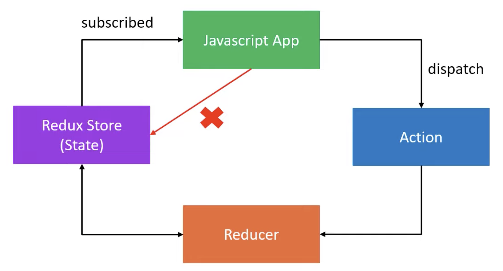

# React Notes

## Commands 

|  |  |
|----------|----------|
| Creating new app | `npx create-react-app <file_name>` |
| Setting different port | Go to package.json and update the command, similar to :-  `"start": "PORT=3001 react-scripts start",`|
| Setting json server | - Use `npm i json-server`  - Set `server-json` in package.json with `"json-server --watch db.json --port 3004"`  - Run using `npm run server-json`   - Endpoint -- [http://localhost:3004/superheroes](http://localhost:3004/superheroes) |
| Setting up react router | - Use `npm i react-router-dom` |
| Setting up react query |  - Use `npm i react-query` |
| <> | <> |

## React Query 
- What is it ?
    - Lib for fetching data in a React application.
- Why we need it ? 
    - Despite having existing state management lib like useState and useEffect, which are great while working with Client state (synchronous) but are not great while working Server state (asynchronous).  
    - Complex requirements like caching, deduping multiple requests for same data, updating stale data in background, performace optimization, etc can be easily handed using React Query library.

## React Styled Components
- What are the benefits / features of using this ? 
- What is polymorphic props ? 
    - a single component with polymorphic props can handle multiple scenarios, leading to a more consistent and predictable codebase.

## Redux 
- What is it ? 
    - Predictable state container for JS apps to manage global state 
- Redux Toolkit is lib for efficient redux development 
- React-redux is a lib that provides bindings to use React and Redux (Toolkit) together in an application 
- Three core concepts : 
    - 
    - Store : holds the state of the application.
    - Action : describes what happend in the application. 
    - Reducer : handles the action & describe how to update the state.
- Three principles : 
    1. **The global state of the application is stored as an object inside a single store**
    2. **The only way to change the state is to dispatch an action, an object that describes what happened**
    3. **To specify how the state tree is updated based on action, you write pure reducers**
        - Pure reducers are the functions which takes previousState and action, and returns a newState. 
        - They should not be updating the previous state.
- 
- The entire applicate's state is split into multiple slices, each slice is a reducer.

## React Table 
- **Its a utility and not a component**
- It is a collection of hooks for building powerful tables and data grid experiences. These hooks are lightweight, composable, and ultra-extensible. They do not render any markup or styles for you

## Topics 
- <input type="checkbox" disabled /> React Fundamentals and Advanced Topics
- <input type="checkbox" disabled /> React Hooks
- <input type="checkbox" disabled /> React Router
- <input type="checkbox" disabled /> React Formik
- <input type="checkbox" disabled /> React Storybook
- <input type="checkbox" disabled /> React Render
- <input type="checkbox" disabled /> React Table
- <input type="checkbox" disabled /> React TypeScript
- <input type="checkbox" disabled checked /> React Query
- <input type="checkbox" disabled checked /> React Styled Components
- <input type="checkbox" disabled checked /> React Redux

