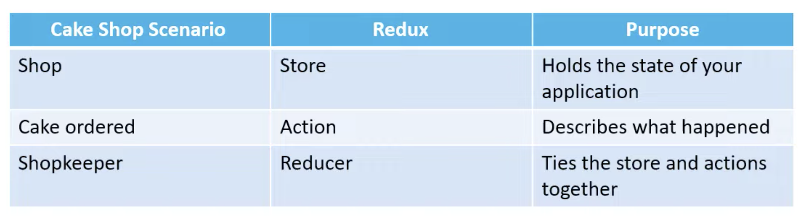

# React Notes

## Commands 

|  |  |
|----------|----------|
| Creating new app | `npx create-react-app <file_name>` |
| Setting different port | Go to package.json and update the command, similar to :-  `"start": "PORT=3001 react-scripts start",`|
| Setting json server | - Use `npm i json-server`  - Set `server-json` in package.json with `"json-server --watch db.json --port 3004"`  - Run using `npm run server-json`   - Endpoint -- [http://localhost:3004/superheroes](http://localhost:3004/superheroes) |
| Setting up react router | - Use `npm i react-router-dom` |
| Setting up react query |  - Use `npm i react-query` |
| <> | <> |

## React Query 

> Despite having existing state management lib like useState and useEffect, these are great while working with client state (synchronous) but not great while working server state (asynchronous).  

> Complex requirements like caching, deduping multiple requests for same data, updating stale data in background, performace optimization, etc can be easily handed using React Query library.

## React Styled Components
- What are the benefits / features of using this? 
